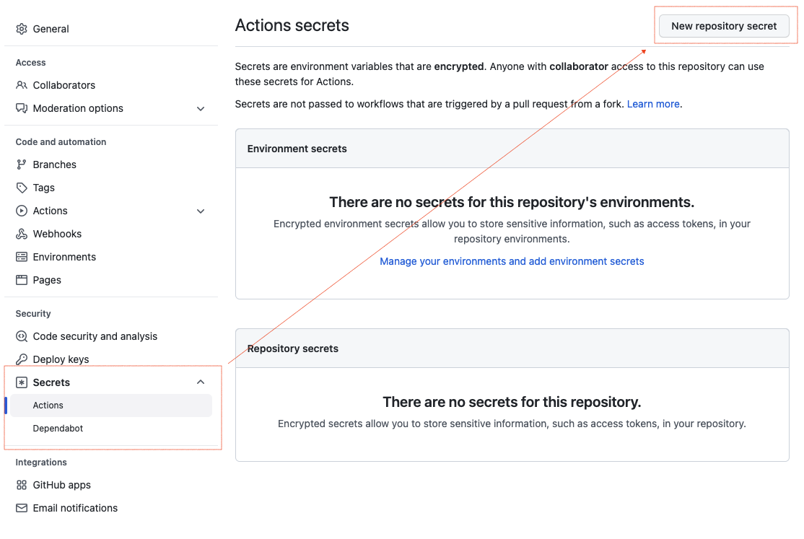
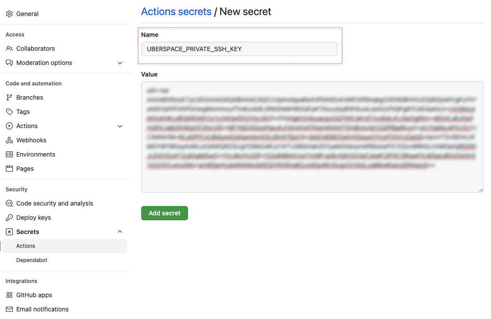
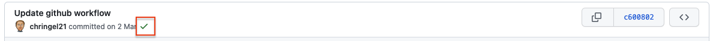

## Premise

So by now you should know that I like to keep things under my control. That's why this blog is [hosted on ateroids :rocket:](https://uberspace.de/en/) (I'm using this phrase so often, I should either trademark it, at least create a shortcode for it). It's content, on the other hand, is under version control at [GitHub](https://github.com/chringel21/chringel.dev).

In the past, my workflow for writing and publishing new content would look like this:

1. Write a new blog post or create a new page in Visual Studio Code
2. Make a commit for that new content and push it to GitHub
3. Run a local script to create a build of my website and sync those files to my webspace, using `rsync`

In far more ancient times 🦕, I wasn't even using `rsync`, but instead would copy the new build with an FTP client. Those days were rough!

## Github Actions

> GitHub Actions makes it easy to automate all your software workflows, now with world-class CI/CD. Build, test, and deploy your code right from GitHub. Make code reviews, branch management, and issue triaging work the way you want.

https://github.com/features/actions

Basically, Github Actions will automate step 3 from above. On a **push** action (i.e. if a commit is pushed to the repository), a script will run and perform all the steps necessary.

## Prerequisites

In order for GitHub to access our remote server, we will need an **SSH key**. You can create one with the following command:

```shell
ssh-keygen -t ed25519 -a 100 -f ~/.ssh/github-deploy

ls -l ~/.ssh/github*

# -rw-------  1 user  staff  432  3 May 16:22 /Users/user/.ssh/github-deploy
# -rw-r--r--  1 user  staff  113  3 May 16:22 /Users/user/.ssh/github-deploy.pub
```

This will create a pair of keys, a **public** one and a **private** one. The public one (`*.pub`) will go to the remote server, the private one (no ending) will be added to GitHub.

Add the public part to your remote server:

```shell
ssh-copy-id -i ~/.ssh/github-deploy.pub user@remote.host
```

Go to your repository's settings page and find the security section on the right. Select _Actions_ and then _New Repository Secret_.



Give your secret a descriptive name and paste the SSH key's private part as _Value_. We can later reference the secret from a repository wide object called `secrets`.



Let's move on to the GitHub Action configuration.

## GitHub Action Workflow

[GitHub Marketplace](https://github.com/marketplace?type=actions) allows us to choose from a variety of pre-configured actions. For this workflow, we'll be using official and custom ones.

In your repository, create a file `.github/workflows/deploy.yml`. We need

- a **name**
- on which **trigger** will this workflow run?
- a **job** with all the necessary steps to checkout, build and deploy

The name can be anything:

```yaml
name: Continuos Deployment
```

We would like to run the workflow on any push to our `main` branch:

```yaml
on:
  push:
    branches: [main]
```

Our workflow contains a single **job**, that does the following steps:

1. Checkout the current repository to a temporary workspace (available as an environment variable called `$GITHUB_WORKSPACE`)
2. Add the Hugo binary to our workspace
3. Clone the theme as a submodule
4. Build the Hugo site
5. Copy the build folder to the remote server using `rsync` and the private key we created earlier

```yaml
jobs:
  build:
    runs-on: ubuntu-latest
    steps:
      # 1.
      - uses: actions/checkout@v2

      # 2.
      - name: Setup Hugo
        uses: peaceiris/actions-hugo@v2
        with:
          hugo-version: "0.90.1"
          extended: true

      # 3.
      - name: Clone theme
        run: git submodule update --init --recursive

      # 4.
      - name: Hugo build
        run: |
          cd $GITHUB_WORKSPACE
          hugo -v

      # 5.
      - name: Rsync Deployments Action
        uses: Burnett01/rsync-deployments@5.2
        with:
          switches: -avzr --delete
          path: public/
          remote_path: /home/user/html/
          remote_host: remote.host
          remote_user: user
          remote_key: ${{ secrets.UBERSPACE_PRIVATE_SSH_KEY }}
```

Be sure to edit the values of the keys `remote_path`, `remote_host` and `remote_user` in the last step, according to your setup. `secrets.UBERSPACE_PRIVATE_SSH_KEY` is the _descriptive_ name we chose when creating the new secret.

Save this file and push it to your repository. It should run immediatly. If everything goes well, you should see a little green tick mark ✅ next to the last commit made to your repository. Click on it to see the output of the workflow. If not ❌, check the output to find the error.



## Wrapping up

Using GitHub Actions I was able to automate the deployment process of my blogging workflow. I needed to add a couple of additional steps, because my Hugo theme uses **Tailwind CSS**, which itself requires some node packages to be installed, but I was able to add these with ease. See the complete config file:

```yaml
# Github Action to generate a Hugo blog and deploy to webserver

name: Continuous Deployment

# Controls when the workflow will run
on:
  # Triggers the workflow on push events but only for the main branch
  push:
    branches: [main]

  # Allows you to run this workflow manually from the Actions tab
  workflow_dispatch:

# A workflow run is made up of one or more jobs that can run sequentially or in parallel
jobs:
  # This workflow contains a single job called "build"
  build:
    # The type of runner that the job will run on
    runs-on: ubuntu-latest

    # Steps represent a sequence of tasks that will be executed as part of the job
    steps:
      # Checks-out your repository under $GITHUB_WORKSPACE, so your job can access it
      - uses: actions/checkout@v2

      # Runs the Hugo command to build public directory
      - name: Setup Hugo
        uses: peaceiris/actions-hugo@v2
        with:
          hugo-version: "0.90.1"
          extended: true

      # Clone the theme as a submodule
      - name: Clone theme
        run: git submodule update --init --recursive

      # Setup node and npm
      - uses: actions/setup-node@v2
        with:
          node-version: "15"

      # Install dependencies for the theme
      - name: Install theme
        run: |
          npm install -g postcss-cli
          npm install -g autoprefixer
          cd themes/chringel
          npm install

      # Build the Hugo web site
      - name: Hugo build
        run: |
          cd $GITHUB_WORKSPACE
          hugo -v

      # Copy build folder to remote using rsync
      - name: Rsync Deployments Action
        uses: Burnett01/rsync-deployments@5.2
        with:
          switches: -avzr --delete
          path: public/
          remote_path: /home/user/html/
          remote_host: remote.host
          remote_user: user
          remote_key: ${{ secrets.UBERSPACE_PRIVATE_SSH_KEY }}
```

---

Source:

- https://github.com/marketplace?type=actions
- https://gohugo.io/hosting-and-deployment/hosting-on-github/
