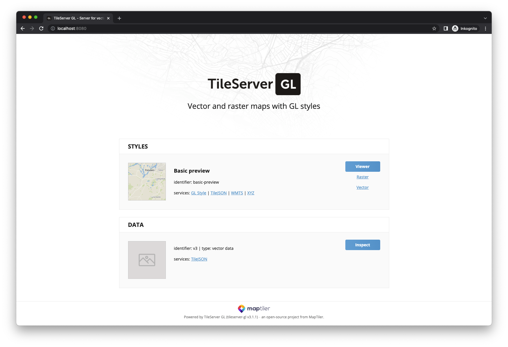
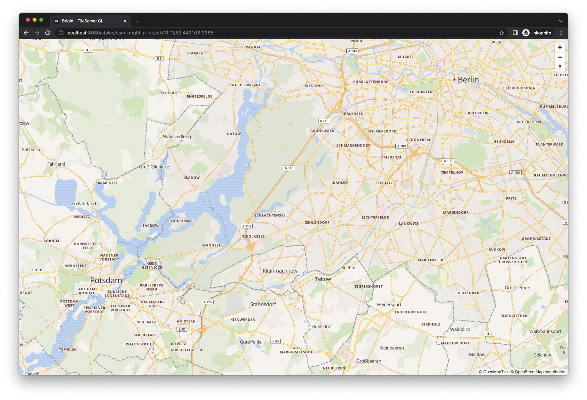
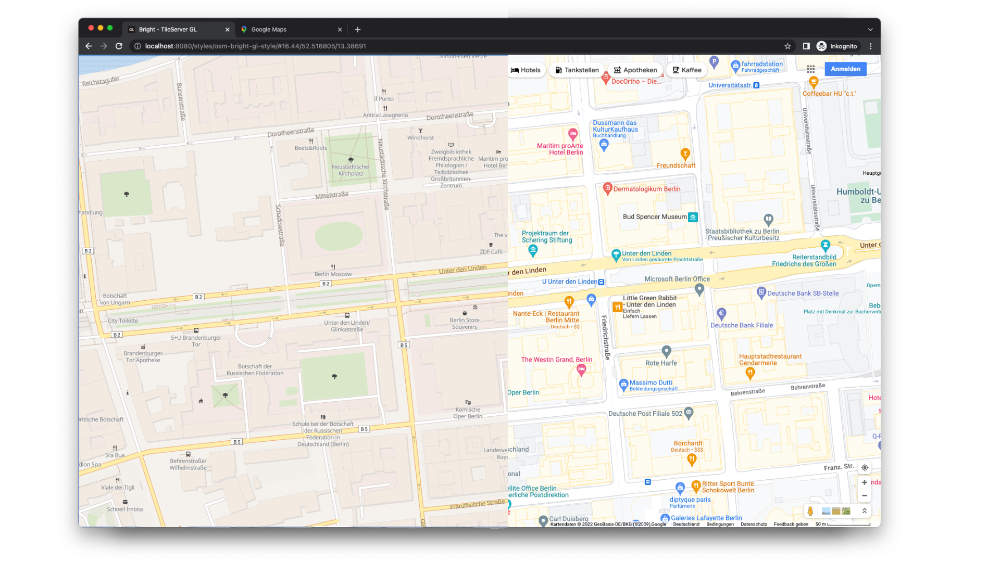

This is a multipart series on how to create a **full stack Google Maps Clone**. It covers every step in the process: How to create **vector tiles** from OpenStreetMap data, serving them using a **tile server**, setting up a simple **geocoder** for searching places and street names, implementing a **routing API** und finally, building a **frontend GUI** to wire everything together. This Google Maps Clone will cover only a small spatial extent. Building the whole world is beyond the scope of this implementation.

## Basics

**If you don't care about the boring 101 stuff or you already know everything about vector tiles (why are you reading this anyway? 🤷), [SKIP AHEAD!](#generate-vector-tiles-using-planetiler)**

Before we start, let's dive into some of the basics for web mapping. Displaying geographic information in a web application usually means you need vector data of your surroundings: **Points** for POIs (points of interest), i.e. bus stations, shops, housenumbers etc. **Lines** for streets, rivers, railways etc. **Polygons** for buildings, parks, sport tracks etc.

There is a whole database of free geographic information available, called [OpenStreetMap](https://www.openstreetmap.org/). You can get either the world as a whole, or download extracts at different scales, for continents, countries, states and (if they are big enough) cities from [Geofabrik](https://download.geofabrik.de/) and other sources.

OpenStreetMap data (`*.osm`) is actually plain XML, but rendering these files from a server or even client is not really efficient, because it contains "because it contains far more information than can be reasonably used in a map" ([Simon Poole](https://twitter.com/sp8962/status/1539149356166696962)). That's why the folks over at [Mapbox](https://www.mapbox.com/) came up with the [de-facto standard specification](https://github.com/mapbox/vector-tile-spec) for encoding tiled vector data.

A common way to serve vector tiles from OpenStreetMap data is storing them in a single SQLite database, called [MBTiles](https://docs.mapbox.com/help/glossary/mbtiles/). A [tile server](https://github.com/mapbox/awesome-vector-tiles#servers) will serve protobuf files with gridded vector data based on longitude, latitude and zoom level (translates to scale).

Take a look at the GIF below. Unique `*.pbf` files are stored (and requested by the client) in a schema that looks like this: `path/to/data/zoom_level/x_position/y_position/xxx.pbf`


The client, in particular a web map client ([MapBox GL JS](https://docs.mapbox.com/mapbox-gl-js/guides/), [MapLibre GL](https://maplibre.org/), [OpenLayers](https://openlayers.org/en/latest/examples/osm-vector-tiles.html)) will render an image based on [specific styling](https://docs.mapbox.com/mapbox-gl-js/style-spec/) information, i.e. river geometries will be painted blue and 10 pixels wide, a bus station will get a special icon and so on. This separation of data and style is especially useful, because it means you can have one data source, and style it according to your needs.

## Vector tile generators

There a lot of different solutions for producing vector tiles. PostGIS, the spatial extension for PostgreSQL, uses [`ST_AsMVT`](https://postgis.net/docs/ST_AsMVT.html) to return binary Mapbox Vector Tile (MVT) representations of geometries. This function in return is used by other tools:

- [martin](https://github.com/urbica/martin), written in Rust
- [postserve](https://github.com/openmaptiles/postserve), written in Python
- [t-rex](https://github.com/pka/t-rex/), written in Rust
- [pg_tileserv](https://github.com/CrunchyData/pg_tileserv), written in Go
- [Tegola](https://github.com/go-spatial/tegola), written in Go
- ...

More established open source map servers also support MVT output:

- [MapServer](https://mapserver.org/development/rfc/ms-rfc-119.html)
- [GeoServer](https://docs.geoserver.org/stable/en/user/extensions/vectortiles/index.html)

A couple of command line tools generate vector tiles from OpenStreetMap data, and here's where it gets interesting. [OpenMapTiles](https://openmaptiles.org/) seems to be the most sophisticated solution, as it will also generate raster tiles through WMS and WMTS, but it requires a database. This is also the case for [Baremaps](https://www.baremaps.com/). With a database in the background to store your OSM data, you can also quite easily update your data.

### Planetiler and Tilemaker

Command line tools requiring no database exist in the form of [Planetiler](https://github.com/onthegomap/planetiler) and [Tilemaker](https://github.com/systemed/tilemaker). Feed them an `osm.pbf` file and they will happily return MBTiles. Planetiler compares a little bit better in my opinion, because it makes better use of the available computing resources. That's why I'm going to focus on **Planetiler**.

## Generate vector tiles using Planetiler

**Planetiler** is quite generous with it's [system requirements](https://github.com/onthegomap/planetiler#usage):

> - Java 16+ or Docker
> - at least 1GB of free disk space plus 5-10x the size of the `.osm.pbf` file
> - at least 0.5x as much free RAM as the input `.osm.pbf` file size

For a small extract, I don't think anyone will be getting into trouble looking at these numbers.

I prefer using Docker. That way, I don't have the hassle of installing a JDK and potentially destroying any `PATH` variables. Run the following command from your working directory.

```shell
docker run \
   -e JAVA_TOOL_OPTIONS="-Xmx1g" \
   -v "$(pwd)/data":/data \
   ghcr.io/onthegomap/planetiler:latest --download --area=brandenburg
```

Use the `--download` flag to let Planetiler handle the OSM file's download. With the `--area=` flag, you can control which extract to download. If you've already downloaded an extract, use the `--osm-path=path/to/file.osm.pbf` flag. If you are using Docker, make sure to put that file into your volume used by Docker.

Once Planetiler is finished, you should have a file called `output.mbtiles` in your `data` directory. Let's take a look at it!

## Serve vector tiles using Tileserver GL

Looking at [this list](https://github.com/mapbox/awesome-vector-tiles#servers) you can see there are a lot of options on how to serve vector tiles, ranging from implementations in PHP and Node.js to Go, Python and others.

My go to solution is [Tileserver GL](https://github.com/maptiler/tileserver-gl/), because it can also serve raster tiles as WMTS. By default it picks up any `*.mbtiles` file from the directory it is run from. Again, run it using Docker:

```shell
docker run \
   -v "$(pwd)/data":/data \
   -p "8080:8080" \
   maptiler/tileserver-gl --port 8080 --verbose
```

Navigate to [http://localhost:8080/](http://localhost:8080/) to view the output of Planetiler.



Click the [TileJSON link](http://localhost:8080/data/v3.json) to see some metadata about the MBTiles. Save the value of the `"bounds"` key for later.

<!-- prettier-ignore -->
```json
{
  "bounds": [
      11.22404, 
      51.35252, 
      14.77917, 
      53.5784
    ]
}
```

By default, Tileserver GL uses a "Basic preview" style. Let's add one more style.

## Add additional styles

Planetiler creates vector tiles based on the [OpenMapTiles profile](https://github.com/onthegomap/planetiler/tree/main/planetiler-basemap). This is basically a schema on how to process OpenStreetMap data and which tags to incorporate into the MBTiles. If you want to create a style sheet for these vector tiles, you need to know how to reference streets, POIs, landmarks and so on. This is stored in the OpenMapTiles profile. Luckily, OpenMapTiles also provides predefined styles based on their profile. A style similar to OpenStreetMap is [OSM Bright](https://github.com/openmaptiles/osm-bright-gl-style).

We need to download the style and make it available to Tileserver GL. Additionally, some fonts are required for this style.

```shell
# Download the style and extract it to data/styles/openmaptiles/osm-bright-gl-style
wget https://github.com/openmaptiles/osm-bright-gl-style/releases/download/v1.9/v1.9.zip
mkdir -p data/styles/openmaptiles/osm-bright-gl-style
unzip v1.9.zip -d data/styles/openmaptiles/osm-bright-gl-style

# Download fonts and extract them to data/fonts
wget https://github.com/openmaptiles/fonts/releases/download/v2.0/v2.0.zip
mkdir -p data/fonts
unzip v2.0.zip -d data/fonts
```

Next, create a file called `config.json` inside your `data` directory, with the following contents. Replace the value of `"bounds"` with the one you saved earlier.

```json
{
  "options": {
    "paths": {
      "root": "/data",
      "fonts": "fonts",
      "styles": "styles",
      "mbtiles": "/data"
    }
  },
  "styles": {
    "osm-bright-gl-style": {
      "style": "openmaptiles/osm-bright-gl-style/style-local.json",
      "tilejson": {
        "bounds": [11.22404, 51.35252, 14.77917, 53.5784]
      }
    }
  },
  "data": {
    "v3": {
      "mbtiles": "output.mbtiles"
    }
  }
}
```

Run Tileserver GL again, with an additional `config` flag.

```shell
docker run \
   -v "$(pwd)/data":/data \
   -p "8080:8080" \
   maptiler/tileserver-gl --port 8080 --config /data/config.json --verbose --mbtiles output.mbtiles
```

Your new shiny **OSM Bright style** should be available.



OpenMapTiles provides more styles, i.e. the dark [Fiord Color GL Style](https://github.com/openmaptiles/fiord-color-gl-style), which is best suited for data visualizations. Once downloaded, you can add them in your `config.json` and they will be available as additional styles.

## Wrapping up and next steps

It is quite possible to create background imagery for a Google Maps clone solely with **open data** and **open source software** tools. OpenStreetMap can provide the data, and modern rendering technologies (Web GL) allow for smooth and sharp web maps to be displayed in your browser. The presented tools make up only a fraction of the open source eco system that has been building up around creating and serving vector tiles. I recommend trying out other approaches.



Of course, creating background imagery is not enough, you need some interaction with the data. The next part will cover setting up a custom search tool for our map, also called **geocoder**.

---

**Update 2022-06-21**

In a previous version of this post I wrote OSM files contained "obsolete information" for web map rendering. As [Simon Poole](https://twitter.com/sp8962/status/1539149356166696962) correctly pointed out, my intention was to say OSM files contain more information than is reasonable for usage in a web map.

---

Sources:

- https://github.com/mapbox/awesome-vector-tiles
- https://github.com/onthegomap/planetiler
- https://github.com/maptiler/tileserver-gl
- https://tileserver.readthedocs.io/en/latest/config.html#options
- https://github.com/openmaptiles/
