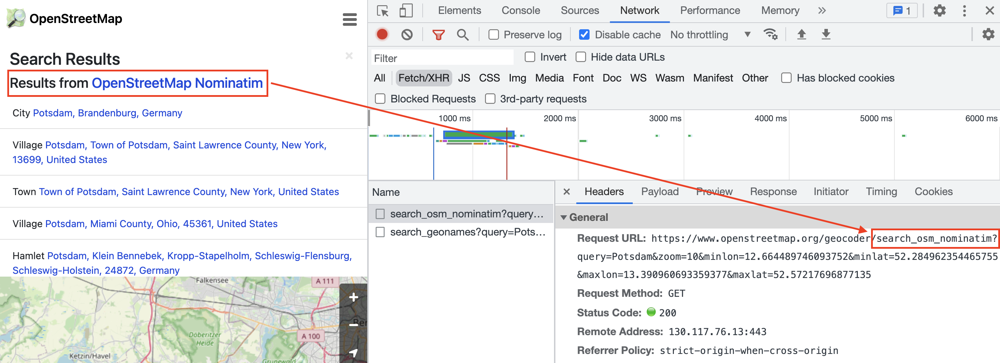
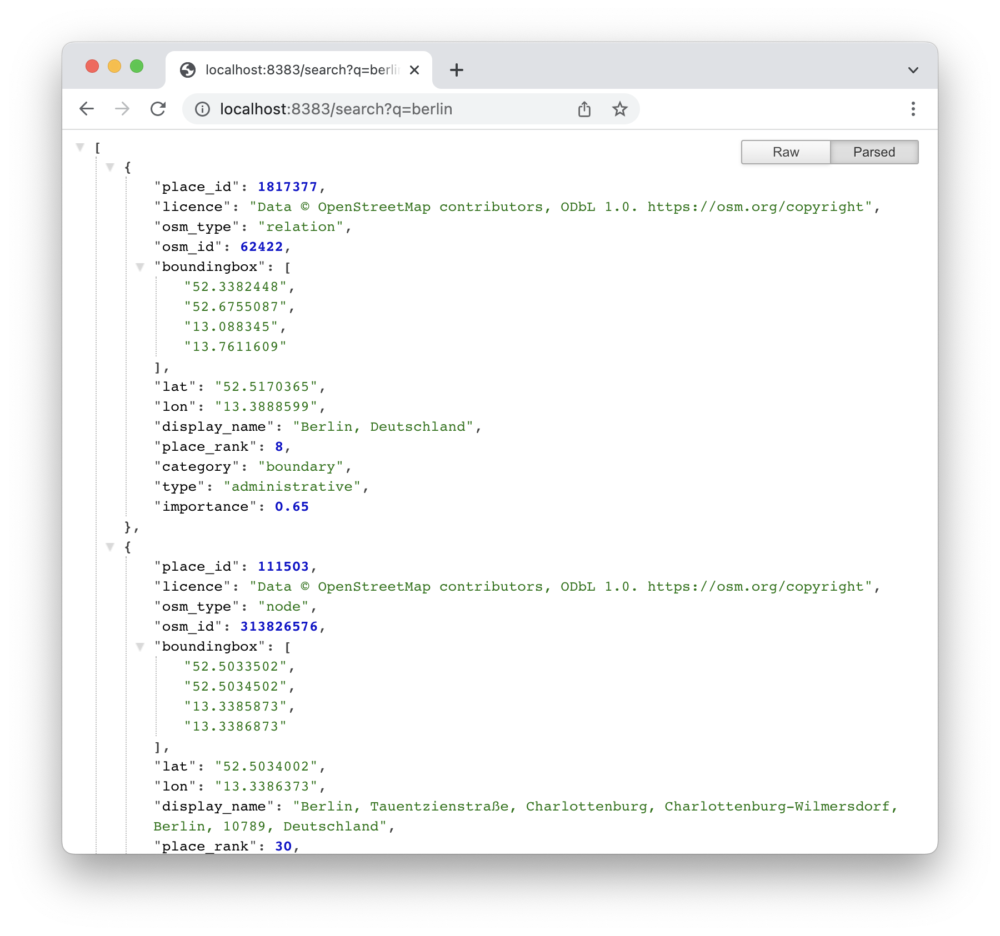
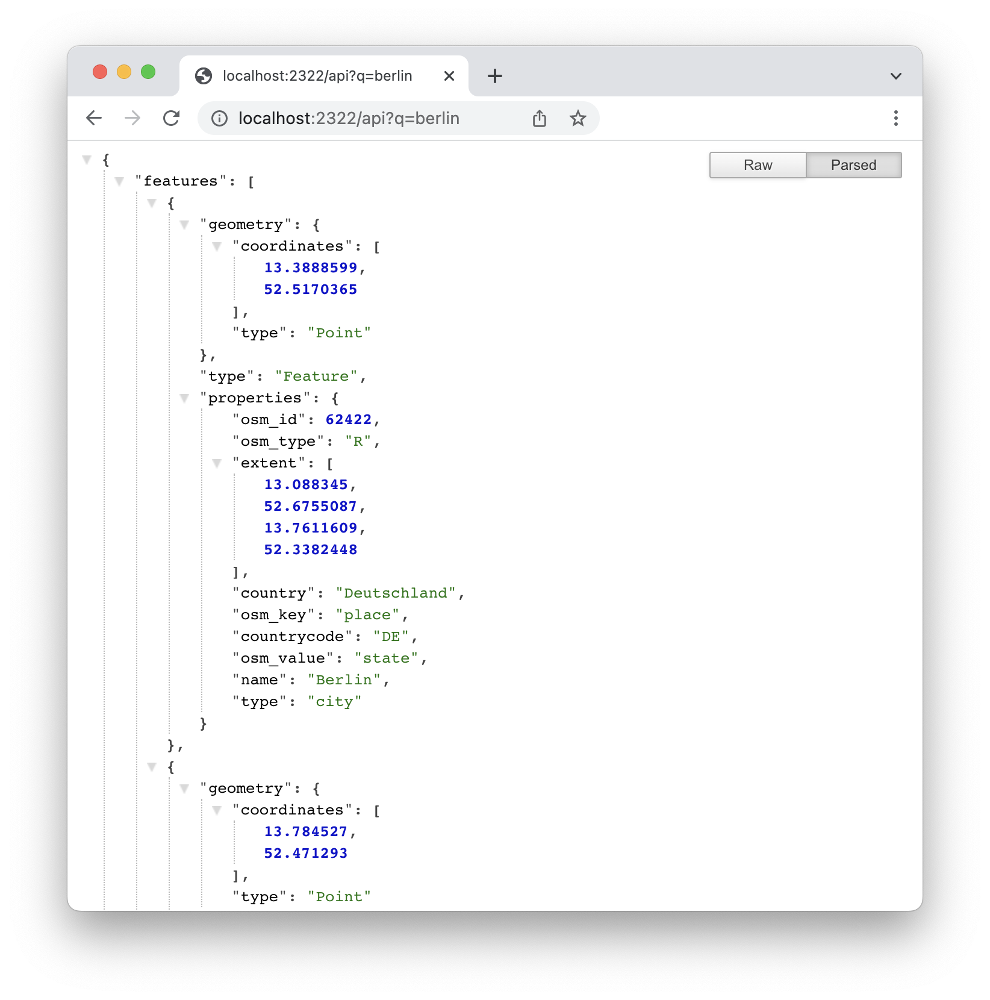

This is a multipart series on how to create a **full stack Google Maps Clone**. It covers every step in the process: [How to create **vector tiles** from OpenStreetMap data, serving them using a **tile server**](/2022/06/creating-a-google-maps-clone-part-1-tiles-and-styles/), setting up a simple **geocoder** for searching places and street names, implementing a **routing API** und finally, building a **frontend GUI** to wire everything together. This Google Maps Clone will cover only a small spatial extent. Building the whole world is beyond the scope of this implementation.

## Basics

**Just like the previous post, I'm going to start with a little bit of basics. If you don't care about the boring 101 stuff or you already know everything about geocoding, Nominatim, etc. (why are you reading this anyway? 🤷), [SKIP AHEAD!](#setting-up-a-geocoding-service)**

One key feature of Google Maps is searching for places. What good is a pretty mapping application, if you don't know where to find your favorite restaurant or where that exact street and housenumber you need to go is located.

Any kind of location, be it a street, a building, a store or a coffee shop, maybe even a statue or a park you want to visit as a tourist, can be seen as a geographic point represented by a pair of numbers - **latitude** and **longitude**.

The process of looking up a location by name and returning that coordinate pair is called **geocoding**. The other way around, searching for coordinates and returning the name of a location (i.e. by clicking any place on a map) is called **reverse geocoding**.

### Geocoding services

Most of the big web mapping providers (Google Maps, Bing Maps, HERE) also have programming APIs that can be used for geocoding. Some are more open or restrictive than others, in terms of how many queries are available for free or in which context the geocoding service is allowed to be used.

Some countries also provide geocoding services using their official census data, for example the [US Census Bureau](https://www.census.gov/data/developers/data-sets/Geocoding-services.html) or the [German Federal Agency for Cartography and Geodesy](https://gdz.bkg.bund.de/index.php/default/webanwendungen/bkg-geocoder.html).

[GISGeography](https://gisgeography.com/geocoders/) has a comprehensive list of geocoders. Be sure to check out the comments as well!

Either way, you'll most likely need to sign up for an account to use these services.

Another downside in using external services might be inconsistencies between your basemap data and the geocoding service's database: A location might show up on your map (because there's a data point for it in your basemap data), but the geocoding service doesn't hold that specific data point and can't find it. So in general I would recommend **using the same data for tiles and geocoding**.

## Nominatim

Since our vector tiles background imagery is based on OpenStreetMap data, we might as well use a geocoder based on that same data.

The most widely used tool for that is [Nominatim](https://nominatim.org/). It also powers the search on the official OpenStreetMap web page.



It's very powerful, but it's not suited for an **auto-complete search**, such as you know it from Google Maps. Even if you would self-host an instance of Nominatim (which is ultimately half of the goal of this post), it would result in heavy load on the server and database, as Nominatim is powered by **PostgreSQL** and **PostGIS**. So, what's the alternative?

## Komoot photon

[Photon](https://photon.komoot.io/), developed by [Komoot](https://www.komoot.de/) describes itself as "search as you type with OpenStreetMap". It is specifically designed for auto-complete search implementations, based on [elasticsearch](http://elasticsearch.org/), so there's no database involved.

While the public API (i.e. `https://photon.komoot.io/api/?q=berlin`) is free to use, they still recommend setting up your own instance, maybe even with custom data.

> You can use the API for your project, but please be fair - extensive usage will be throttled. We do not guarantee for the availability and usage might be subject of change in the future. - [photon](https://photon.komoot.io/#terms-of-use)

Well, what are we waiting for?

## Setting up a geocoding service

When we were generating vector tiles in the [previous post](/2022/06/creating-a-google-maps-clone-part-1-tiles-and-styles/) we chose Brandenburg, Germany as the target region. It includes the capital city Berlin, so it's a good example. We'll stick to that.

To create a custom **photon search index** for Brandenburg, we need an instance of Nominatim for that region.

**Side note**: Photon provides prebuilt world and country wide search indexes ready for download:

- [world](https://download1.graphhopper.com/public/photon-db-latest.tar.bz2), currently around 62 GB
- [by country code](https://download1.graphhopper.com/public/extracts/by-country-code/)

So, if your aim is to set up a geocoding service for a country or for the whole world, you can skip setting up Nominatim.

### Run Nominatim using Docker

The easiest way to get a working Nominatim instance is to use Docker. [mediagis](https://github.com/mediagis/nominatim-docker) provides Dockerfiles for the latest major releases of Nominatim.

Use the following command:

```shell
docker run -it --rm --shm-size=2g \
  -e THREADS=4 \
  -e POSTGRES_SHARED_BUFFERS=1GB \
  -e POSTGRES_MAINTENANCE_WORK_MEM=2GB \
  -e POSTGRES_AUTOVACUUM_WORK_MEM=1GB \
  -e POSTGRES_EFFECTIVE_CACHE_SIZE=6GB \
  -e PBF_URL=https://download.geofabrik.de/europe/germany/brandenburg-latest.osm.pbf \
  -e REPLICATION_URL=https://download.geofabrik.de/europe/germany/brandenburg-updates/ \
  -e NOMINATIM_PASSWORD=superSecretPassword \
  -p 8080:8080 -p 5433:5432 \
  nominatim:3.7
```

This will download and run the docker image, and in return download the OpenStreetMap extract for Brandenburg. If you want to reuse the extract from the previous post, replace the flag environment variable `PBF_URL` with `PBF_PATH` and add a volume flag:

```shell
docker run -it --rm --shm-size=2g \
  -e THREADS=4 \
  -e POSTGRES_SHARED_BUFFERS=1GB \
  -e POSTGRES_MAINTENANCE_WORK_MEM=2GB \
  -e POSTGRES_AUTOVACUUM_WORK_MEM=1GB \
  -e POSTGRES_EFFECTIVE_CACHE_SIZE=6GB \
  -e PBF_PATH=/data/sources/brandenburg.osm.pbf \
  -e REPLICATION_URL=https://download.geofabrik.de/europe/germany/brandenburg-updates/ \
  -e NOMINATIM_PASSWORD=superSecretPassword \
  -v "$(pwd)/data":/data \
  -p 8383:8080 -p 5433:5432 \
  nominatim:3.7
```

If you want to persist the database files, you can also add another volume flag:

```shell
...
  -v "$(pwd)/data/nominatim-data":/var/lib/postgresql/12/main \
...
```

However you would like to run Nominatim, importing all the data will take some time (especially indexing rank 30). It wll generate output that should look something like this:

```
Using project directory: /nominatim
Creating database
Setting up database
...
Reading input files done in 101s (1m 41s).
  Processed 22043187 nodes in 58s - 380k/s
  Processed 3547323 ways in 37s - 96k/s
  Processed 48151 relations in 6s - 8k/s
node cache: stored: 22043187(100.00%), storage efficiency: 50.41% (dense blocks: 148, sparse nodes: 21258501), hit rate: 100.00%
...
Indexing places
Starting indexing rank (0 to 4) using 4 threads
Starting rank 1 (using batch size 1)
Done 0/0 in 0 @ 0.000 per second - FINISHED rank 1
...
Done 1446040 in 1756 @ 823.246 per second - rank 30 ETA (seconds): 2.80
Done 1446860 in 1757 @ 823.040 per second - rank 30 ETA (seconds): 1.80
Done 1447700 in 1759 @ 822.767 per second - rank 30 ETA (seconds): 0.78
Done 1448341/1448341 in 1760 @ 822.655 per second - FINISHED rank 30
...
[539] LOG:  listening on IPv4 address "0.0.0.0", port 5432
[539] LOG:  listening on IPv6 address "::", port 5432
[539] LOG:  listening on Unix socket "/var/run/postgresql/.s.PGSQL.5432"
[540] LOG:  database system was shut down at 2022-07-15 09:15:13 UTC
[539] LOG:  database system is ready to accept connections
```

Once everything's done, you can even send a sample query to `http://localhost:8080/search?`, i.e. [http://localhost:8080/search?q=berlin](http://localhost:8080/search?q=berlin).



Be sure to let Nominatim run in the background, we'll need it in the next step.

### Build photon search index

Fire up a new terminal window and download photon:

```shell
curl https://github.com/komoot/photon/releases/download/0.3.5/photon-0.3.5.jar -o photon.jar -Ls
```

It requires Java, at least in version 8. Next step is simply running photon and telling it, which database with Nominatim data to query:

```shell
java -jar photon.jar \
  -nominatim-import \
  -host localhost \
  -port 5433 \
  -database nominatim \
  -user nominatim \
  -password superSecretPassword \
  -languages en
```

Since the Nominatim docker container currently exposes it's PostgreSQL database at port 5433, photon can access it. Use the password from the docker container's environment variable, `NOMINATIM_PASSWORD`. You can also add more comma separated languages, if needed, i.e. `-languages en,de,fr`.

This will create the photon search index in a directory called `photon_data`.

### Run photon

Now that the search index is ready, run photon:

```shell
java -jar photon.jar
```

It will automatically pick up the data directory, but you can also provide a flag `-data-dir` to point to the parent directory of `photon_data`.

Once the index is loaded, you can send queries to `http://localhost:2322/api`, i.e. [http://localhost:2322/api?q=berlin](http://localhost:2322/api?q=berlin). It's output is [GeoJson](https://geojson.org/), so basically ready to be consumed by a web mapping application.



## Wrapping up and next steps

Setting up your own geocoding service using **open data** and **open source software** is not that hard, if you know the steps. Once the search index is ready, it can also be moved to any place or server you like. It's even simpler if you downloaded by country code, if that's enough for your use case.

Photon provides no UI, but there are a couple of implementations, for example for [Leaflet](https://github.com/komoot/leaflet.photon) or [OpenLayers](https://github.com/webgeodatavore/photon-geocoder-autocomplete).

It's a fast, and the API is super simple. Use the **location bias** to get results based on a given location (`api?q=berlin&lon=10&lat=52`). Change the **language** for the results, if available (`api?q=berlin&lang=fr`). **Reverse geocoding** is also possible (`reverse?lon=10&lat=52`).

For a full API documentation please refer to the [README at Github](https://github.com/komoot/photon#search-api).

The next step would be to implement a graphical user interface for your geocoding service. We'll tackle that obstacle right after we implemented a **routing service**.

Sources:

- https://gisgeography.com/geocoders/
- https://nominatim.org/release-docs/3.7.2/
- https://github.com/mediagis/nominatim-docker
- https://operations.osmfoundation.org/policies/nominatim/
- https://github.com/komoot/photon
