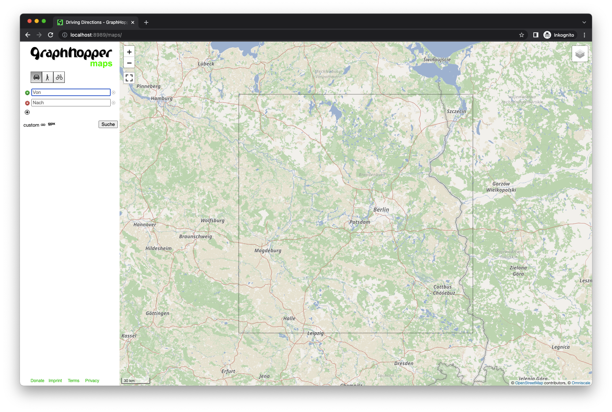
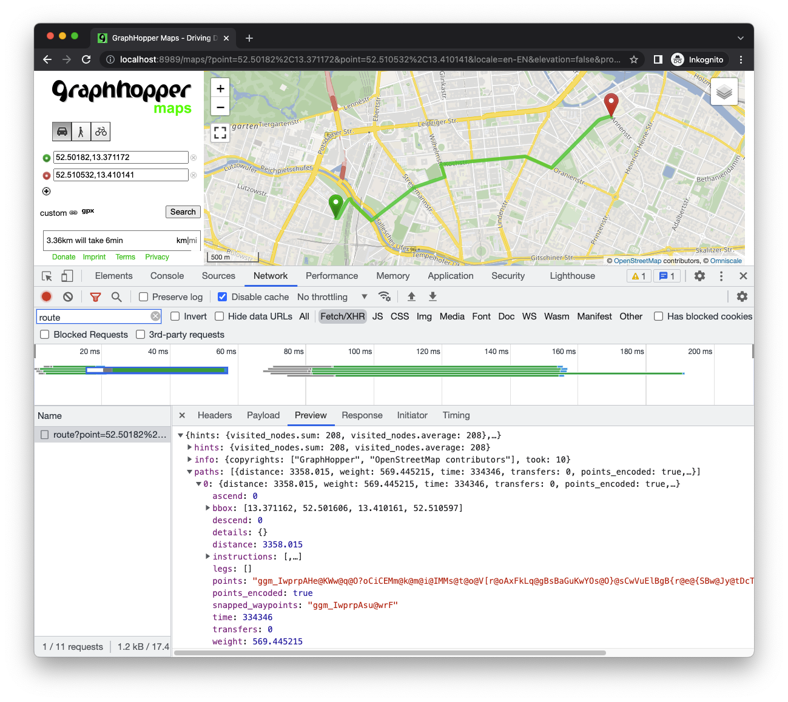

## Basics

**Just like the previous posts, I'm going to start with a little bit of basics. If you don't care about the boring 101 stuff or you already know everything about routing engines and algorithms (why are you reading this anyway? 🤷), [SKIP AHEAD!](#setting-up-a-routing-service)**

Another essential Google Maps service, aside from finding a place, is knowing, how to get there. Given a start, destination and optionally locations in between, the routing algorithm will provide you with a set of instructions on how to navigate from point A to point B, accompanied by a graphical representation of that route.

Looking at the traversable streets and pathways from an algorithms perspective, they are just a network of **nodes** and **edges**. A node is a point, where for example two streets are crossing, and a turn can be made. An edge on the other hand, is the road itself. Combined, they make up a routing **graph**. Additionally, edges can be attributed by a cost or weight. In its simplest form, the length of street is the cost to traverse it. More advanced weights would be speed limits or a path's slope. Nodes might have turn restrictions associated with them.

The algorithm's job is to calculate the shortest path between two points, taking into account the node's and edge's attributes, in this case the node's length. But not always the shortest path is interesting: What's the fastest route, which route has the smoothest ride in terms of surface type, and so on. I think you get the idea.

## Open source routing engines

The fine folks over at GIS-OPS have put together a [comprehensive list](https://gis-ops.com/open-source-routing-engines-and-algorithms-an-overview/#user-content-other-routing-engines) of open source routing engines, which I don't want to replicate here. I would just like to point out the four, in my opinion, most well established open source projects for OpenStreetMap based routing.

### Graphhopper

[Graphhopper](https://github.com/graphhopper/graphhopper) is written in Java and comes with a lot of standard routing profiles (walking, hiking, wheelchair, multiple bikes, car and motorcycle). It has good performance and relatively moderate requirements when it comes to building a graph and during runtime.

### OSRM

Development of this [C++ written tool](https://github.com/Project-OSRM/osrm-backend) was once lead by Mapbox, but dropped ever since they switched to supporting and developing Valhalla. OSRM has great performance, even for long continent-spanning routing requests. It is customizable via Lua scripts, no fiddling around with source code required.

### Valhalla

[Valhalla](https://github.com/valhalla/valhalla) is unique in it's way of handling profiles. The graph is split up in small chunks, similar to how vector tiles are stored. This makes Valhalla the most flexible routing engine when it comes to profiles and on-the-fly customizations.

### pgRouting

The PostgreSQL extension [pgRouting](https://github.com/pgRouting/pgrouting) is easy to install, and there's also a [command line tool](https://github.com/pgRouting/osm2pgrouting) to import OpenStreetMap data ready for routing. Customization is as easy as altering an SQL statement. Without optimization however, pgRouting lacks in terms of performance, at least for calculating long routes.

## Setting up a routing service

We want to build a routing service for a relatively small extent, Brandenburg, Germany, to be precise. If you've been following this series, you can reuse the already downloaded OSM file. I'll be using Graphhopper to setup a routing service. It runs on Java, which is available almost anywhere, if you don't want to rely on Docker. The prebuilt profiles for car, bike and walking are good enough and performance is great for such a small extent.

### Graphhopper configuration

You can find the default configuration example [here](https://github.com/graphhopper/graphhopper/blob/master/config-example.yml). We'll add bike and walking profiles to the already existing car profile. Name your configuration file something like `config-graphhopper.yml`.

```yaml
...
##### Vehicles #####

# More options: foot,hike,bike,bike2,mtb,racingbike,motorcycle,car4wd,wheelchair (comma separated)
# bike2 takes elevation data into account (like up-hill is slower than down-hill) and requires enabling graph.elevation.provider below.
graph.flag_encoders: car,bike,foot

# Enable turn restrictions for car or motorcycle.
graph.flag_encoders: car|turn_costs=true
...
##### Routing Profiles ####
profiles:
  - name: car
    vehicle: car
    weighting: short_fastest
    distance_factor: 0.1
    turn_costs: true
    u_turn_costs: 60
  - name: foot
    vehicle: foot
    weighting: shortest
  - name: bike
    vehicle: bike
    weighting: shortest
...
# Speed mode:
profiles_ch:
  - profile: car
  - profile: foot
  - profile: bike
...
```

Edits we made:

- `graph.flag_encoders`: Added `bike` and `foot`
- `graph.flag_encoders`: Enabled calculating turn costs for `car`
- Edited the `car` profile and added `foot` and `bike` profiles
- Added above profiles to be built with contraction hierarchies (`profiles_ch`) to speed up routing queries

Leave the rest as it is.

### Run Graphhopper using Docker

An easy way to run Graphhopper is using Docker. [This image](https://github.com/IsraelHikingMap/graphhopper-docker-image-push/blob/main/Dockerfile) works well. Run it using the following command:

```shell
docker run \
  -p 8989:8989 \
  -v "$(pwd)/data:/data" \
  israelhikingmap/graphhopper \
  --input /data/brandenburg.osm.pbf \
  --host 0.0.0.0 \
  --config /data/config-graphhopper.yml
```

Make sure to put both the OpenStreetMap extract and the `config-graphhopper.yml` in a folder called `data` in your current working directory, as it will be mounted as a volume.

Once the graph is ready and prepared, the output should read something like this:

```
...
[main] INFO  o.e.j.server.handler.ContextHandler - Started i.d.j.MutableServletContextHandler@4bc59b27{/,null,AVAILABLE}
[main] INFO  o.e.jetty.server.AbstractConnector - Started application@f1a45f8{HTTP/1.1, (http/1.1)}{0.0.0.0:8989}
[main] INFO  o.e.jetty.server.AbstractConnector - Started admin@5edf2821{HTTP/1.1, (http/1.1)}{localhost:8990}
[main] INFO  org.eclipse.jetty.server.Server - Started @403058ms
```

Open [http://localhost:8989](http://localhost:8989). It should redirect you to the built in graphical user interface, that comes with Graphhopper (`/maps`).



You can play around with it, try setting start and destination points, add intermediate points, change the routing profile and see how it affects the result.

### Parse the results

More interesting might be the API and the result's structure:



By default, the Routing API won't return an easily parseable GeoJson linestring. Instead, the result is an [Encoded Polyline Algorithm Format](https://developers.google.com/maps/documentation/utilities/polylinealgorithm). Server-side, the linestring is encoded to a single string, and [decoded client-side](https://github.com/graphhopper/directions-api-js-client/blob/cf43d1a5bc93a3e8007a44fcfc551117e4fa49bc/src/GHUtil.js#L27). This whole process takes less time, than sending a full GeoJson to the client.

```
# encoded
"ggm_IwprpAHe@KWw@q@O?oCiCEMm@k@m@i@IMMs@t@o@V[r@oAxFkLq@gBsBaGuKwYOs@O}@sCwVuElBgB{r@e@{SBw@Jy@tDcTmBqDsAuCsCkF{AcDsD_HyD_H[w@CQw@oG@g@FI"

# decoded
"points":
  {
    "type":"LineString",
    "coordinates":
    [
      [13.371162,52.501804],
      [13.371359,52.501758],
      [13.371472,52.501812],
      [13.371721,52.50209],
      [13.371727,52.502172],
      [13.372412,52.502893],
      ...
      [13.410111,52.510586],
      [13.410161,52.51054]
    ]
  }
```

Try to decode the above string with [Google's Polyline Interactive Utility](https://developers.google.com/maps/documentation/utilities/polylineutility).

Direction instructions are also available:

```json
"instructions":
  [
    {
      "distance":14.293,
      "heading":111.19,
      "sign":0,
      "interval":[0,1],
      "text":"Continue onto Lützowstraße",
      "time":2058,
      "street_name":"Lützowstraße"
    },
    {
      "distance":238.09,
      "sign":-2,
      "interval":[1,10],
      "text":"Turn left onto Flottwellstraße",
      "time":34283,
      "street_name":"Flottwellstraße"
    },
    {
      "distance":291.249,
      "sign":2,
      "interval":[10,14],
      "text":"Turn right onto Schöneberger Ufer, B 96",
      "time":23297,
      "street_name":"Schöneberger Ufer, B 96"
    },
    ...
    {
      "distance":0.0,
      "sign":4,
      "last_heading":145.70316730176836,
      "interval":[37,37],
      "text":"Arrive at destination",
      "time":0,
      "street_name":""
    }
  ]
```

The full documentation for the API can be found [here](https://docs.graphhopper.com/#operation/getRoute).

## Wrapping up and next steps

Using **open data** and **open source software**, it is possible to set up a routing service with minimal configuration, comparable to Google Maps's Directions service.

There a multiple solutions available. This post features **Graphhopper**, for its simple configuration and low system requirements.

It comes with a built in graphical user interface, and integrating it in a custom mapping application requires implementing a sophisticated parsing solution. But thanks to the great documentation, that won't be a problem!

Sources:

- https://gis-ops.com/open-source-routing-engines-and-algorithms-an-overview/#user-content-osrm
- https://github.com/graphhopper/graphhopper/blob/master/docs/core/profiles.md
- https://developers.google.com/maps/documentation/directions/overview
- https://developers.google.com/maps/documentation/utilities/polylinealgorithm
