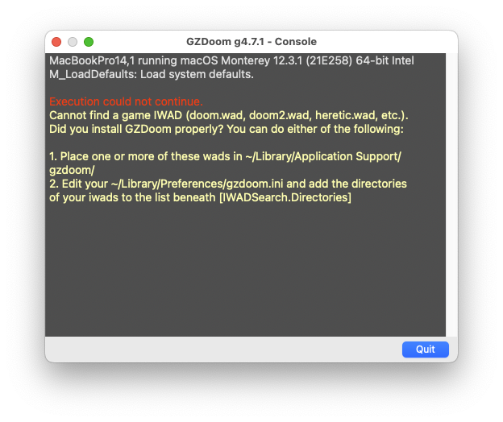

## TL;DR

This is the short **get-to-the-point** way with no optimization whatsoever.

- [Install Homebrew](https://brew.sh/)
- [Download GZDoom for Mac](https://zdoom.org/downloads) or

```shell
brew install gzdoom
```

- If you don't own Doom or Doom 2 already, download the Windows installer of an original Doom release from either [GOG](https://www.gog.com/en/game/the_ultimate_doom) or [Steam](https://store.steampowered.com/app/2280/Ultimate_Doom/?curator_clanid=35501448)
- Download innoextract

```shell
brew install innoextract
```

- Extract files from Doom installer

```shell
innoextract -d ~/Doom ~/Downloads/setup_the_ultimate_doom_1.9_\(28044\).exe
```

- Copy `DOOM.WAD` to config folder

```shell
cp ~/Doom/DOOM.WAD ~/Library/Application\ Support/gzdoom/DOOM.WAD
```

- Run GZDoom with `DOOM.WAD`

```shell
/Applications/GZDoom.app/Contents/MacOS/gzdoom -f ~/Doom/DOOM.WAD
```

## My Background With Doom

It must have been like 2000-2001-ish when I first played Doom. I was too young to experience it when it first released, and when I played it for the first time, **I didn't like it**. Yes, I admit it. I didn't get what everyone else was seeing in this game. The enemies' sprite design didn't appeal to me, controls where clunky. Every shooter I had played up to this point (Half-Life, Unreal Tournament, Thief, ...) seemed far more superior to me.

Only later I disvocered what kind of impact Doom had on the industry. Doom did for PC gaming, what Nirvana did for rock music. The story of **id Software**, it's inception and how they conceived their games is also very intruiging. I strongly recommend [David Kushner's _Masters of Doom_](https://en.wikipedia.org/wiki/Masters_of_Doom), if you are interested in that.

With the emerging **boomer shooter** craze in recent years - [Boomer Shooter Humble Bundle](https://www.pcgamer.com/humbles-boomer-shooter-bundle-is-one-of-the-best-fps-collections-ive-seen/), [Curated list on Steam](https://store.steampowered.com/curator/41054936-boomershooter/), ["What's a Boomer Shooter" on YouTube](https://www.youtube.com/watch?v=dXCOKpJcYZU) - I've been rediscovering the original [Doom](https://github.com/id-Software/DOOM). And I wanted to play it on MacOS.

While it is relatively easy to get Doom and Doom 2 running on **Windows** platforms, with releases on [GOG](https://www.gog.com/en/game/the_ultimate_doom) and [Steam](https://store.steampowered.com/app/2280/Ultimate_Doom/?curator_clanid=35501448), I've struggled quite a bit to get it running on MacOS. I'm currently stuck on a Mac because of work and because I made the switch to Mac about 6 years ago. Before that, I've been working with different Linux distributions.

## Requirements

### Additional tools

[Brew](https://brew.sh/) will make everything much easier, so we are going to install that first. Fire up a terminal, paste the following line and execute it.

```shell
/bin/bash -c "$(curl -fsSL https://raw.githubusercontent.com/Homebrew/install/HEAD/install.sh)"
```

OK, now that we've got Brew, install a source port of Doom. What's that?

To run Doom, Doom 2 or any of the Doom Mods on MacOS, you will need a so called [source port](https://en.wikipedia.org/wiki/List_of_Doom_ports#List_of_source_ports). As Doom basically [runs on anything](https://www.reddit.com/r/itrunsdoom/), there are obviously ports that run on Mac.

The most sophisticated and commonly used source port is [GZDoom](https://zdoom.org/index). This will allow you to run basically every _idTech 1_ game (Heretic, Hexen, Strife, Chex Quest) on modern systems.

In the terminal, type the following command.

```shell
brew install gzdoom
```

While you're at it, also download a tool called **innoextract**. This will allow us to extract Windows-like archives and get a hold of their contents.

```shell
brew install innoextract
```

### Doom Assets

Although you now have a port of the engine, you still need some assets (level, textures, sounds, ...), the so called **WADs**. Doom is available on GOG for a small dime. Download the installer for Windows. Don't worry if it is an `EXE` file, that's why we installed innoextract previsouly.

Extract the files from the GOG installer, using this command:

```shell
innoextract -I DOOM.WAD -d ~/doomwads ~/Downloads/setup_the_ultimate_doom_1.9_\(28044\).exe
```

This will only extract the actual `DOOM.WAD` and place it in a folder called `doomwads` in your user's folder.

```shell
ls ~/doomwads

DOOM.WAD
```

You can store additional WADs for modifications or other games in this folder.

### Running GZDoom

GZDoom will look in certain directories for WADs. If you run GZDoom right now, it will give you a hint about those directories.



You could do, what the message says, and place the `DOOM.WAD` into `~/Library/Application Support/gzdoom/`, but who is ever going to find that folder again.

Looking at the file `~/Library/Preferences/gzdoom.ini` will show us all the directories GZDoom actually searches for WADs.

```ini
# These are the directories to automatically search for IWADs.
# Each directory should be on a separate line, preceded by Path=
[IWADSearch.Directories]
Path=.
Path=$DOOMWADDIR
Path=/Users/cengel-wg/Documents/GZDoom
Path=/Users/cengel-wg/Library/Application Support/GZDoom
Path=$PROGDIR
Path=/Library/Application Support/GZDoom
```

---

Source: xyz
